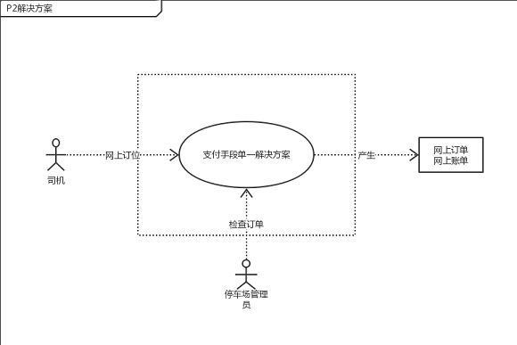
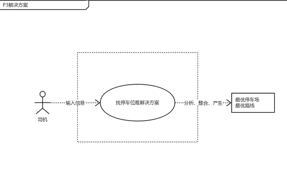
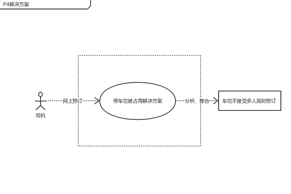
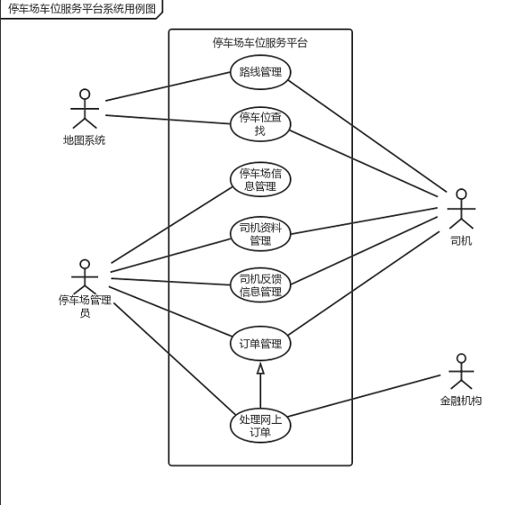

# 4. 定义解决方案及系统特性

## 4.1 确定高层次的解决方案

　　首先，我们对每一个明确一致的问题都尽可能发现各种可行的解决方案

<table>
<tr>
    <th>问题</th>
    <th>解决方案</th>
    
</tr>
<tr>
    <td>P1</td>
    <td>S1. 建立停车场车位信息平台和数据库，对车位进行分类，实时更新系统平台的车位信息 
    </td>
</tr>
<tr>
    <td>P2</td>
    <td>S1. 收费尽量调整为整数 
        S2. 开辟网上订位和网络支付渠道 
        S3. 开通刷卡业务 
    </td>
</tr>
<tr>
    <td>P3</td>
    <td>S1. 实现一个自动化子系统来发布和更新各城市各地方的各个停车场地理位置，并提供路况信息和导航服务 
    </td>
</tr>
<tr>
    <td>P4</td>
   <td>S1. 提供电话预订车位，安排更多的人处理订单和结算账单 
       S2. 实现一个自动化子系统，用来预订车位和处理订单分类排序以及账单     结算 
    </td>
</tr>
</table>

 
 

　　最后，通过面谈和探讨，开发人员和客户对每个问题共同确定了以下高层次的解决方案：
<table>
<tr>
    <th>ID</th>
    <th>P1</th>
    
</tr>
<tr>
    <td><b>方案描述</b></td>
    <td>建立停车场车位信息平台和数据库，对车位进行分类，实时更新系统平台的车位信息</td>
</tr>
<tr>
    <td><b>业务优势</b></td>
    <td>记录每个停车场的车位信息,从而可以实时显示每个城市的每个停车场的信息，方便司机进行快速查找，节约时间,减少车位的浪费</td>
</tr>
<tr>
    <td><b>代价</b></td>
    <td>实现此功能模块所需的软件费用</td>
</tr>
</table>

 

<table>
<tr>
    <th>ID</th>
    <th>P2</th>
    
</tr>
<tr>
    <td><b>方案描述</b></td>
    <td>开辟网上订位和网络支付渠道，并对老顾客实现一定的优惠</td>
</tr>
<tr>
    <td><b>业务优势</b></td>
    <td>新的支付手段开通，有利于对潜在司机客户的增加，减少司机的支付时间，提高支付效率，降低停车场的人员收费成本</td>
</tr>
<tr>
    <td><b>代价</b></td>
    <td>实现此功能模块所需的软件费用，以及开通网络支付所需的手续费用</td>
</tr>
</table>

 

<table>
<tr>
    <th>ID</th>
    <th>P3</th>
    
</tr>
<tr>
    <td><b>方案描述</b></td>
    <td>建立停车场车位信息系统平台，对车位进行分类，支持司机输入信息查找以及筛选功能并能根据司机地点显示最短路线信息，并提供导航服务</td>
</tr>
<tr>
    <td><b>业务优势</b></td>
    <td>记录每个停车场的车位信息,从而可以实时显示每个城市的每个停车场的信息，方便司机进行快速查找以及快速到达目的地，提供导航服务</td>
</tr>
<tr>
    <td><b>代价</b></td>
    <td>实现此功能模块所需的软件费用，以及开通GPS定位和导航服务的费用</td>
</tr>
</table>

 

<table>
<tr>
    <th>ID</th>
    <th>P4</th>
    
</tr>
<tr>
    <td><b>方案描述</b></td>
    <td>系统实时显示停车场车位的空余数量情况，支持停车场车位在线预订，同一时间段只接受一个司机的预订</td>
</tr>
<tr>
    <td><b>业务优势</b></td>
    <td>有效利用到每个车位资源，减少司机停车时间，避免冲突</td>
</tr>
<tr>
    <td><b>代价</b></td>
    <td>司机预订车位但没到，造成车位资源白白浪费，以及实现此功能模块所需的软件费用</td>
</tr>
</table>

 

 

## 4.2 确定系统特性和解决方案的边界

　　在选定解决方案之后，我们进一步明确了该解决方案需要具备的功能特征，及系统特性： 

<table>
<tr>
    <th>针对的问题</th>
    <th>解决方案需要具备的系统特性</th>
</tr>
<tr>
    <td><b>P1</b></td>
    <td>系统记录和保存停车场信息及其车位信息</td>
</tr>
<tr>
    <td><b>P2</b></td>
    <td>系统开通网上预订和网络支付手段，并记录老顾客信息</td>
</tr>
<tr>
    <td><b>P3</b></td>
    <td>系统实时发布每个停车场信息和其车位空余情况以及路况信息</td>
</tr>
<tr>
    <td><b>P4</b></td>
    <td>系统自动化处理订单排序分类和账单的汇总，及时更新车位数据库</td>
</tr>
</table>

 

　　然后根据这些功能特征，分析解决方案需要和周围环境形成的交互作用，
定义解决方案的边界。解决方案的边界确定了信息流的输入输出关系：
 

</img>

</img>

</img>

</img>

 

## 4.3 确定解决方案的约束

　　约束在总体上限制了开发人员设计和构建系统时的选择范围。
我们从操作性、系统及操作系统、设备预算、人力资源和技术要求这几个主要的约束来源来考察每个解决方案的约束。
如下表所示：
 
 

P1:

| 约束源 | 约束 | 理由 |
| ------ | ------- | -------- |
| 操作性 | 需要对停车场管理员进行相关车位信息录入的培训 | 录入车位数据库，方便进一步存储、分析 |
| 系统及操作系统 | 数据库在服务器上的大小不超过500G | 控制成本，保证无冗余数据 |
| 设备预算 | 系统在已构造好的服务器和主机上开发 | 控制成本，方便 |
| 人力资源 | 不需要外部的人员，使用已有的员工 | 固定操作成本 |
| 技术要求 | 良好的人机交互界面 | 方便员工进行录入 |

 

P2:

| 约束源 | 约束 | 理由 |
| ------ | ------- | -------- |
| 操作性 | 无 | 方便客户或司机支付，减少支付时间 |
| 系统及操作系统 | 需要同第三方支付平台进行集成，对客户数据库进行变更 | 采用第三方支付平台，方便支付，减少支付时间 |
| 设备预算 | 系统在已构造好的服务器和主机上开发 | 控制成本，方便 |
| 人力资源 | 不需要外部的人员，使用已有的员工 | 固定操作成本 |
| 技术要求 |  良好的人机交互界面 | 方便司机支付停车费用 |

 

P3:

| 约束源 | 约束 | 理由 |
| ------ | ------- | -------- |
| 操作性 | 通过一定的操作获得客户的信息输入 | 系统需要信息进行筛选 |
| 系统及操作系统 | 系统根据司机信息显示最优的停车场的几个方案，并根据选择显示地图最短路线 | 多种方案选择有利于司机筛选 |
| 设备预算 | 系统在已构造好的服务器和主机上开发 | 控制成本，方便 |
| 人力资源 | 不需要人力资源 | 无需成本 |
| 技术要求 | 使用面向对象技术，良好的人机交互界面 | 方便客户查找 |

 

P4:

| 约束源 | 约束 | 理由 |
| ------ | ------- | -------- |
| 操作性 | 无 | |
| 系统及操作系统 | 系统显示停车场的车位空余信息，每个车位同一时间只接受一个司机的预订 | 防止一个车位被多人同时选中 |
| 设备预算 | 系统在已构造好的服务器和主机上开发 | 控制成本，方便 |
| 人力资源 | 不需要人力资源 | 无需成本 |
| 技术要求 | 良好的人机交互界面 | |

## 4.4 确定系统边界

　　最后将所有问题的解决方案进行综合，就可以得到整个系统的功能和边界。
为了更直观地描述系统的功能和边界，我们绘制了停车场车位平台服务系统的上下文图： 
在这个上下文图中表示出了所有和停车场车位平台交互的外部实体，并描述出了交互的数据流，
包括系统输入和系统输出。
 

</img>

　　另外，为了直接记录和描述从用户那里得到的信息，我们采用面向对象的方法以
系统所有用例的集合为基础，建立了用例模型，用统一、图形化的方式展示系统
的功能和行为特性。
 
 
</img>

